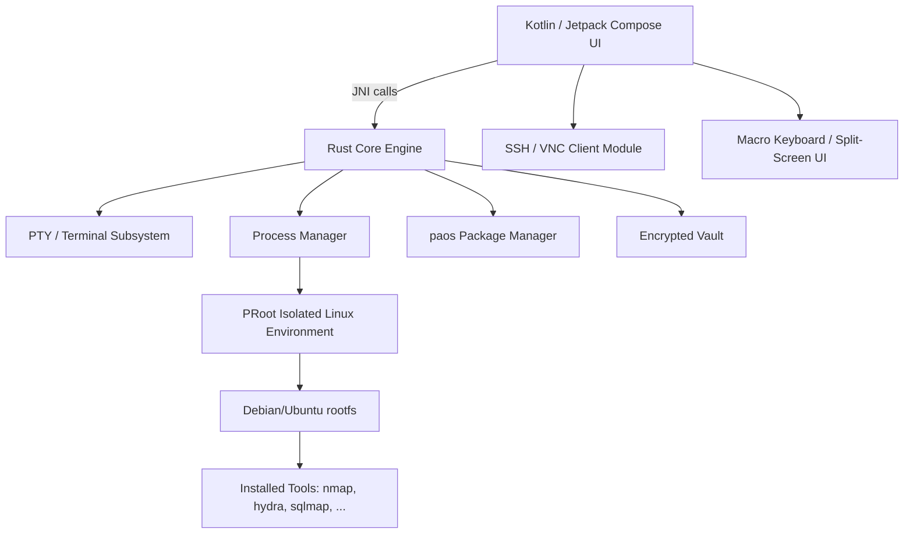

# PhantomAOS — Architecture Design

## 1. Overview

PhantomAOS is built on three layers: a Kotlin/Jetpack Compose UI shell, a memory-safe Rust core engine, and an isolated PRoot-based Linux environment. The Rust core does the heavy lifting (PTY, process management, package manager, encrypted storage); the UI layer is a thin, native Android wrapper around it.

---

## 2. High-Level Architecture



---

## 3. Layer Breakdown

### 3.1 Frontend — Kotlin + Jetpack Compose
Handles UI rendering, tabs/split-screen, keyboard input, permissions, lifecycle (foreground service for long sessions), and calls into the Rust core via JNI.

*Why Kotlin here, not pure Rust:* there's no mature native Rust GUI toolkit for Android. Compose + JNI gives native performance where it matters (the core) and idiomatic Android UX where it matters (the shell).

### 3.2 Core Bridge — Rust
Handles PTY allocation, process spawning/management, ANSI/VT100 parsing, package manager logic, encrypted vault, plugin host. Compiled to `libphantomcore.so` for `aarch64-linux-android` and `armv7a-linux-androideabi`, exposed to Kotlin via JNI.

*Why Rust:* a security tool shouldn't be the attack surface. Rust's ownership model removes whole classes of memory-corruption bugs (use-after-free, buffer overflows) that would be a serious liability in exactly this kind of app.

### 3.3 Phantom Environment — PRoot Isolation
Bootstraps and runs a full userspace Linux rootfs without root, using PRoot to emulate privileged syscalls (chroot, mount, setuid) in userspace. Each environment is isolated per session, stored in app-private storage, optionally encrypted at rest. Rooted devices are supported too, and root unlocks the clearly-labeled advanced features described below.

*Honest limitation:* PRoot carries performance overhead versus real namespaces, and some syscalls (raw sockets, certain kernel-module-dependent tools) aren't supported without root. This is disclosed in-app, not hidden behind marketing.

---

## 4. Component Detail

**Terminal / PTY Subsystem**
- `forkpty()` via the `nix` crate allocates a real pseudo-terminal pair
- Shell process attaches to the slave end; master end streams to the UI over a JNI callback
- Full job control: SIGINT/SIGTSTP handling, foreground/background process groups

**Package Manager (`paos`)**
- Manifest-based: a JSON/TOML index of packages, each with a GitHub Releases URL + checksum
- MVP: small, manually curated and compiled set
- Later: GitHub Actions CI watches upstream repos, cross-compiles for `aarch64`, publishes signed binaries to the index

**Encrypted Vault**
- AES-256-GCM via a well-reviewed crate (e.g. `aes-gcm` or `ring`)
- Key derived from a user passphrase via Argon2 — never stored in plaintext
- Panic-wipe destroys the key, making vault data unrecoverable

**SSH / VNC Client**
- SSH via `russh` or FFI to `libssh2`
- VNC via a Rust VNC crate or minimal custom client
- Credentials live only in the encrypted vault, never in plaintext config files

**Plugin System** *(later phase)*
- WASM-based sandboxed plugins (via `wasmtime` or `wasmer`)
- Capability-based API — filesystem/network access explicitly granted per plugin, never ambient

---

## 5. Data Flow Example — Running a Command

User types in the Compose UI → input forwarded via JNI to the Rust core → Rust writes to the PTY master → shell processes the command inside the PRoot environment → output streams back through the PTY → Rust parses ANSI codes → a JNI callback pushes rendered output to the Compose UI.

---

## 6. Repository Structure

Current layout of the repository:

```
PhantomAOS/
├── .github/workflows/      # GitHub Actions CI (Rust core build)
├── app/                    # Kotlin/Compose Android app module (JNI bridge)
├── core/
│   └── phantom-core/       # Rust core: PTY engine + job control
├── gradle/wrapper/
├── build.gradle.kts
├── settings.gradle.kts
├── ARCHITECTURE.md
├── ROADMAP.md
├── LICENSE
└── README.md
```

Planned additions to the Rust core as the roadmap progresses: `paos` (package manager), `vault` (encrypted storage) and `plugin-host` (WASM plugin runtime), each as its own crate under `core/`.

---

## 7. Build Pipeline

- **Local dev:** Rust core built and tested on desktop Linux first for fast iteration, then cross-compiled with `cargo ndk` for Android targets.
- **CI:** GitHub Actions runs `cargo test` on every push (desktop target), plus a release workflow cross-compiling the `.so` and packaging the APK.
- **Package mirror:** a separate, later-phase workflow tracks upstream tool repos and cross-compiles binaries for the `paos` index.

---

## 8. Security Model

- Authorized-use policy enforced at launch (explicit opt-in disclaimer)
- No telemetry; no network calls beyond the package index and user-initiated connections
- PRoot environment confined to app-private storage
- Vault encrypted at rest; panic-wipe available
- Root-dependent features (monitor mode, MAC randomization) clearly gated and labeled — never silently assumed to work

---

## 9. Licensing

PhantomAOS is released under the GPL-3.0 license. See the `LICENSE` file for details.
